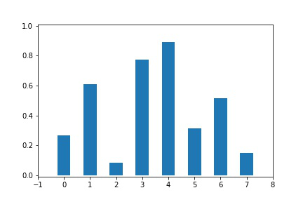
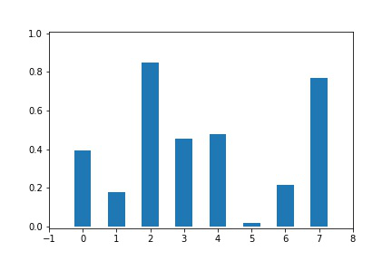

# Sorting

A sorting algorithm a day, keeps bugs away.

## Bubble Sort

```C
for (int i = 0; i < arr.length; i++)
    for (int j = i+1; j < arr.length; j++)
        if (compare(arr[i], arr[j]) < 0)
        {
            arr[i] = arr[i] ^ arr[j];
            arr[j] = arr[i] ^ arr[j];
            arr[i] = arr[i] ^ arr[j];
        }
```


## Bogo Sort (Monkey Sort)


```c
while(!Sorted(arr))
    Shuffle(arr);
```


## Sleep Sort

**zzzZZZ**

```c
for (int i = 0; i < arr.length; i++)
    res.append(SleepThread(arr[i]).start());
```


## Stooge Sort

Three stooges **do not** top one wise.

```c
ARRAY StoogeSort (ARRAY arr, int begin, int end)
{
    if(compare(arr[begin], arr[end-1]) < 0)
    {
    	arr[begin] = arr[begin] ^ arr[end-1];
        arr[end-1] = arr[begin] ^ arr[end-1];
        arr[begin] = arr[begin] ^ arr[end-1];
    }
    if (end-begin >= 3)
    {
        one_third = (end - begin) / 3;
        arr = StoogeSort(arr, begin, begin+2*one_third);
        arr = StoogeSort(arr, begin+one_third, end);
        arr = StoogeSort(arr, begin, begin+2*one_third);
    }
    return arr;
}
```



## Slow Sort

Divide **without** conquer

```C
ARRAY SlowSort(ARRAY arr, int begin, int end)
{
    if (begin >= end)
        return arr;
    int mid = floor((begin+end)/2);
    arr = SlowSort(arr, begin, mid);
    arr = SlowSort(arr, mid+1, end);
    if (Compare(arr[mid], arr[end]) < 0)
    {
        arr[mid] = arr[mid] ^ arr[end];
        arr[end] = arr[mid] ^ arr[end];
        arr[mid] = arr[mid] ^ arr[end];
    }
    return SlowSort(arr, begin, end-1);
}
```

