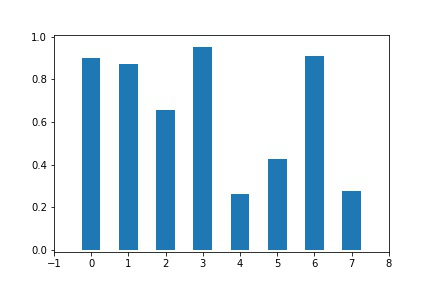
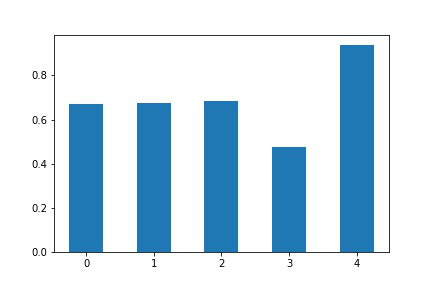
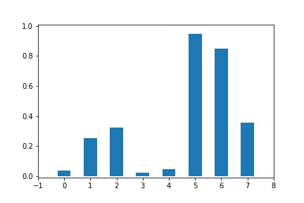

# Sorting

A sorting algorithm a day, keeps bugs away.

## Bubble Sort

```C
for (int i = 0; i < arr.length; i++)
    for (int j = i+1; j < arr.length; j++)
        if (compare(arr[i], arr[j]) < 0)
        {
            arr[i] = arr[i] ^ arr[j];
            arr[j] = arr[i] ^ arr[j];
            arr[i] = arr[i] ^ arr[j];
        }
```



## Bogo Sort (Monkey Sort)


```c
while(!Sorted(arr))
    Shuffle(arr);
```



## Sleep Sort

**zzzZZZ**

```c
for (int i = 0; i < arr.length; i++)
    res.append(SleepThread(arr[i]).start());
```

